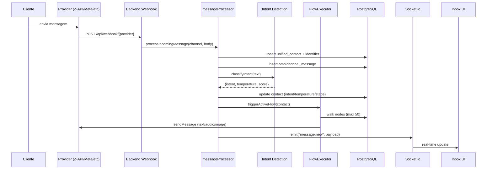
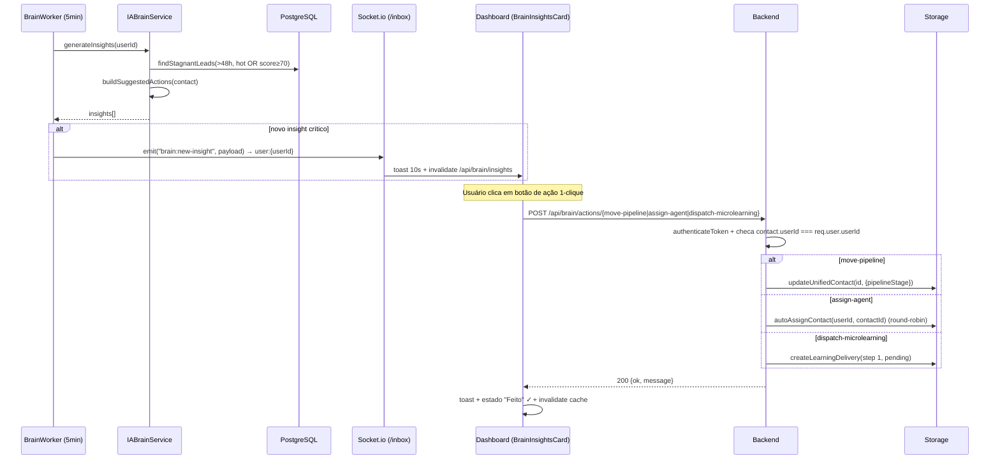

# Quanta Flow — Fluxo Visual da Arquitetura

> Diagramas em ASCII/Mermaid descrevendo as principais jornadas e arquitetura do sistema.

## 1. Arquitetura Macro

```
┌─────────────────────────────────────────────────────────────────────┐
│                           CLIENTES (CLI)                            │
│  WhatsApp · Telegram · Instagram · Email · Web (futuro)             │
└────────────────────────────┬────────────────────────────────────────┘
                             │
                             ▼
┌─────────────────────────────────────────────────────────────────────┐
│                     PROVIDERS (camada externa)                      │
│  Z-API · Baileys · Meta Cloud · Telegram Bot · Graph API · SMTP     │
└────────────────────────────┬────────────────────────────────────────┘
                             │ webhooks
                             ▼
┌─────────────────────────────────────────────────────────────────────┐
│                 BACKEND — Express + Socket.io (port 5000)           │
│  ┌──────────────┐  ┌──────────────┐  ┌──────────────┐               │
│  │ Auth/RBAC    │  │ messageProc. │  │ AI Intent    │               │
│  └──────────────┘  └──────┬───────┘  └──────┬───────┘               │
│  ┌──────────────┐         │                 │                       │
│  │ FlowExec.    │◄────────┘                 │                       │
│  └──────┬───────┘                           │                       │
│         │                                   │                       │
│         ▼                                   ▼                       │
│  ┌──────────────────────────────────────────────────────┐           │
│  │  Storage (Drizzle ORM) ──► PostgreSQL                │           │
│  └──────────────────────────────────────────────────────┘           │
│                                                                     │
│  Workers em background:                                             │
│   • JobQueue (5s)        • LearningWorker (5min)                    │
│   • CampaignWorker (60s) • WebhookDispatcher (async, HMAC)          │
└────────────────────────────┬────────────────────────────────────────┘
                             │
                             ▼ HTTP + Socket.io
┌─────────────────────────────────────────────────────────────────────┐
│              FRONTEND — React + Vite + Tailwind + shadcn            │
│  Login · Inbox · CRM/Kanban · Automação · Campanhas · Estúdio       │
│  Admin/Settings · Admin/Lab (cockpit) · Admin/Documentação          │
└─────────────────────────────────────────────────────────────────────┘
```

## 2. Fluxo de Mensagem Recebida



## 3. Pipeline de Lead (Kanban)

```
[Novo] ──► [Qualificando] ──► [Proposta] ──► [Negociação] ──► [Ganho]
                │                                                 │
                ▼                                                 ▼
          [Sem Resposta]                                      [Perdido]

Cada movimentação dispara:
 • outbound_webhooks (lead.qualified, etc.)
 • google_sheets append (se configurado)
 • atualização de temperatura/score por IA
```

## 4. Fluxo Visual Builder — Tipos de Bloco

```
┌─────────────┐     ┌─────────────┐     ┌─────────────┐
│   text      │     │  audio_tts  │     │  image_ai   │
└──────┬──────┘     └──────┬──────┘     └──────┬──────┘
       │                   │                   │
       └───────────────────┼───────────────────┘
                           │
       ┌───────────────────┼───────────────────┐
       ▼                   ▼                   ▼
┌─────────────┐     ┌─────────────┐     ┌─────────────┐
│   delay     │     │  condition  │     │  ai_agent   │
└──────┬──────┘     └──┬──────┬───┘     └──────┬──────┘
       │               │ SIM  │ NÃO            │
       │               ▼      ▼                ▼
       │          ┌─────┐  ┌─────┐      ┌─────────────┐
       │          │ ... │  │ ... │      │   webhook   │
       │          └─────┘  └─────┘      └──────┬──────┘
       │                                       │
       ▼                                       ▼
┌─────────────┐     ┌─────────────┐     ┌─────────────┐
│queue_entry  │     │   resolve   │     │ update_lead │
└─────────────┘     └─────────────┘     └─────────────┘
```

## 5. Camadas de Segurança

```
1. Network        ─► HTTPS (Replit)
2. Auth           ─► JWT 24h + tokenVersion (invalidação imediata)
3. Authorization  ─► RBAC middleware (checkRole / checkPermission)
4. Rate limiting  ─► express-rate-limit em /api/auth/*
5. Encryption     ─► AES-256-CBC em settings sensíveis
6. Webhooks       ─► HMAC-SHA256 signing
7. Audit          ─► audit_logs + settings_audit
```

## 6. Workers Assíncronos

```
JobQueue (5s)              ─► send_message, check_inactivity, check_sla
LearningWorker (5min)      ─► entrega de microlearning por gatilho
CampaignWorker (60s)       ─► processa campaign_deliveries pendentes
BrainWorker (5min)         ─► varredura de insights críticos + Socket.io push
WebhookDispatcher (async)  ─► dispara webhooks com HMAC + 5s timeout
SLA Watcher (no JobQueue)  ─► alerta quando SLA estoura
```

## 6.1 Fluxo IA Brain — Insights & Ação 1-clique



## 7. Estrutura de Diretórios

```
quanta-flow/
├── client/                     # Frontend React + Vite
│   ├── src/
│   │   ├── pages/              # admin-lab, admin-documentation, inbox, crm...
│   │   ├── components/         # shadcn ui, app-sidebar, theme-toggle
│   │   ├── hooks/              # useAuth, useToast, useSocket
│   │   └── lib/                # queryClient, utils
├── server/                     # Backend Express
│   ├── index.ts                # bootstrap + seeds
│   ├── routes.ts               # todas as rotas REST
│   ├── storage.ts              # IStorage + implementação Drizzle
│   ├── services/               # messageProcessor, flowExecutor, ai
│   └── workers/                # jobQueue, campaignWorker, learningWorker
├── shared/
│   └── schema.ts               # Drizzle tables + Zod schemas
├── CLAUDE.md                   # diretrizes do agente
├── CHANGELOG.md                # histórico de versões
├── FEATURES.md                 # catálogo
├── STORIES.md                  # user stories
├── DICTIONARY.md               # dicionário de dados
├── VISUAL_FLOW.md              # este arquivo
├── TESTING.md                  # estratégia de testes
└── DEPLOY_GUIDE.md             # guia de deploy
```
